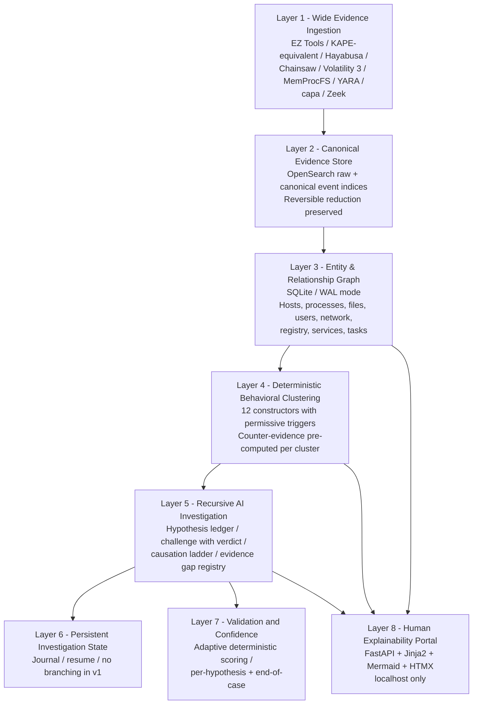
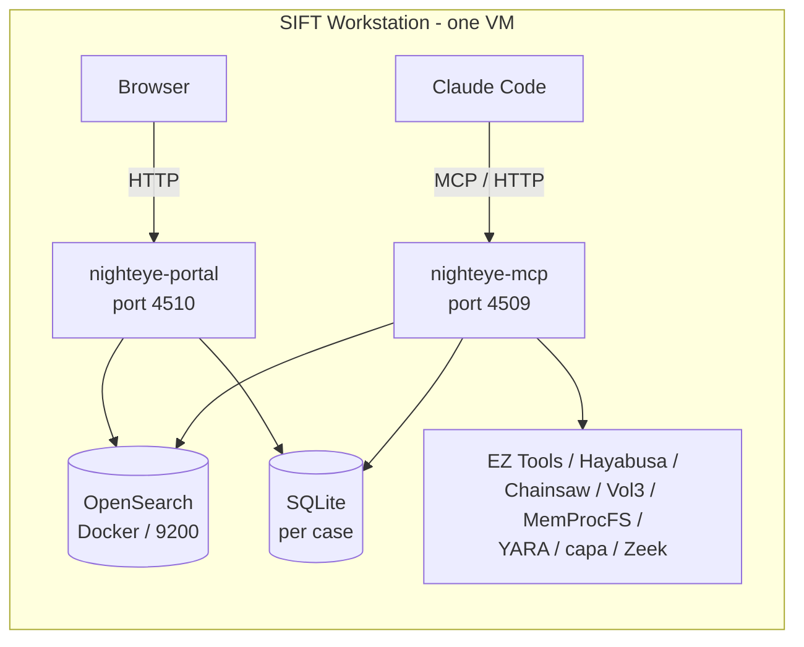
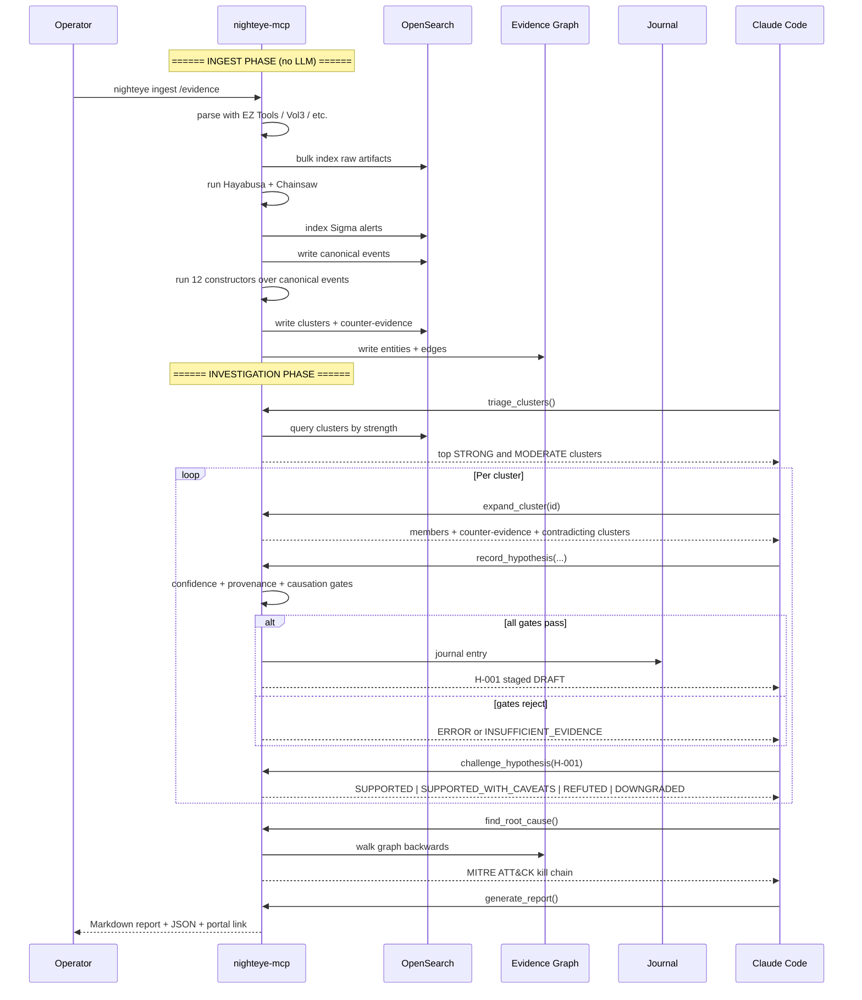

# NightEye

> Autonomous AI-driven Digital Forensics & Incident Response agent for the
> [SANS FindEvil! Hackathon 2026](https://findevil.devpost.com/). Triages
> incidents at the speed adversaries operate, with architectural constraints
> that block hallucinated findings and pre-computed clusters that let the
> agent reason over reduced evidence rather than raw event streams.

**Status:** design complete, build starting.
**Target submission:** June 15, 2026.
**Reference to exceed:** [Valhuntir](https://github.com/AppliedIR/Valhuntir).

---

## What NightEye does

NightEye is a single-process MCP server that:

1. **Ingests broadly** — runs every relevant Eric Zimmerman parser, Hayabusa,
   Chainsaw, Volatility 3, MemProcFS, YARA, capa, and Zeek over a forensic
   case at ingest time, indexing everything into OpenSearch with ECS field
   mappings.
2. **Normalizes to canonical events** — a fixed event-type taxonomy
   (`PROCESS_EXECUTION`, `AUTHENTICATION`, `FILE_WRITE`, etc.) that
   constructors consume independent of source artifact.
3. **Builds behavior clusters at ingest** — 12 deterministic
   constructors (LateralMovement, Persistence, CredentialAccess,
   RemoteExecution, DefenseEvasion, Beaconing, Collection, Exfiltration,
   Impact, plus 6 anti-forensic) with permissive triggers and graded
   confidence. Hayabusa Sigma matches feed constructors as inputs, not as a
   parallel detection layer.
4. **Pre-computes counter-evidence per cluster** — every cluster carries
   refuting signals alongside supporting ones, so the agent's
   self-correction is a single read, not a parallel investigation.
5. **Drives a recursive AI investigation loop** — agent reads clusters,
   forms hypotheses, calls `challenge_hypothesis` for conclusive verdicts,
   builds a MITRE ATT&CK-aligned kill chain.
6. **Persists investigation state** — journal entries survive across
   Claude Code sessions; investigations resume after context exhaustion.
7. **Validates with adaptive deterministic confidence** — same factors
   evaluated everywhere, weights conditional on what's actually applicable
   to the case (single-host vs enterprise, anti-forensic observed vs not,
   intel sources configured vs not).
8. **Renders an explainability portal at localhost** — clusters,
   hypotheses, entity-relationship graph, timeline, journal. Functional,
   not pretty.

---

## Architecture at a glance

### Eight-layer stack



### Single MCP server, internal grouping



### Investigation flow



---

## Core design principles

1. **Ingest broadly, normalize, then reduce.** Cast a wide net at ingest
   (every relevant parser, every memory plugin). Normalize to canonical
   events. Cluster constructors run over canonical events. Reversible at
   every step.
2. **Architectural constraints, not prompt constraints.** Confidence
   scoring, causation verification, provenance tiers, anti-forensic
   propagation, and verdict requirements are enforced in code. The LLM
   cannot smuggle weak claims through.
3. **Permissive triggers, graded confidence.** Constructors fire on ANY
   recognized primitive of an attack class; cluster strength reflects the
   totality of supporting and counter signals. Single-trigger novel
   variants surface (with low strength); flooded-with-noise patterns are
   suppressed automatically.
4. **Counter-evidence pre-computed.** Self-correction is not a parallel
   investigation — every cluster carries refuting evidence already.
   `challenge_hypothesis` is a single-pass tool that returns a conclusive
   verdict.
5. **Adaptive deterministic confidence.** Same factors, weights
   conditional on what applies to the case. Single-host case with full
   corroboration can score HIGH; enterprise case that only checked one
   host gets penalized appropriately.
6. **Persistent investigation state.** Investigations survive context
   exhaustion. Journal records decisions, verdicts, and resume points.
7. **Reversible reduction.** Cluster → canonical events → raw artifact
   docs. Every layer expandable. No conclusion is opaque.
8. **The agent must commit.** `INSUFFICIENT_EVIDENCE` is allowed only
   when an evidence_gap is explicitly registered. The agent cannot
   indefinitely defer; it must reach a conclusion or document why it
   can't.

---

## Decision log

| Decision | Choice |
|---|---|
| Project name | NightEye |
| License | MIT |
| Language | Python 3.11+ |
| MCP framework | FastMCP |
| Server count | 1 MCP + 1 Portal (same process, different ports) |
| MCP port | 4509 |
| Portal port | 4510 |
| Transport | Streamable HTTP |
| VMs required | 1 (SIFT). Optional Windows helper deferred to v2 |
| Storage | OpenSearch (Docker) for events; SQLite (WAL) for graph + state |
| Field mapping | ECS v8.x |
| Index naming | `case-{id}-{artifact}-{host}` |
| Detection: L1 | Hayabusa + Chainsaw at ingest, fed into constructors |
| Detection: L4 | 12 behavior constructors (6 TTP + 6 anti-forensic) |
| Detection: L5 | Agent investigation with hypothesis ledger |
| Cluster matching | Permissive triggers (ANY one fires), graded confidence |
| Counter-evidence | Pre-computed at ingest per cluster |
| Self-correction | Single-pass `challenge_hypothesis` returning conclusive verdict |
| Confidence | Adaptive deterministic — factors fixed, weights conditional on case profile |
| Approval default | Auto-approve at strongest tier (HIGH + MCP provenance + clean + proven causation); else DRAFT |
| Causation ladder | 6 levels: CHAIN > WRITE > NET > TIGHT_TIME > CO_OCCUR > TEMPORAL_ONLY |
| Branching investigations | Deferred to v2 |
| Journal | Per-case, shared across sessions |
| Validation timing | Per-hypothesis (gates) + end-of-case (reconciliation) |
| Demo dataset | SRL-2015 primary; SRL-2018 scale benchmark |
| Snapshot delivery | OpenSearch snapshot tarball + 5MB synthetic test fixture |
| Install paths | Quick (snapshot) / BYO (judge data) / Full (raw E01 reingest) |
| KAPE | Replicate target list ourselves (Option 2, license-free path) |

---

## Documentation map

| Document | Purpose |
|---|---|
| **`README.md`** | Project overview, decisions, navigation (this file) |
| [`docs/ARCHITECTURE.md`](docs/ARCHITECTURE.md) | Full architecture: 8-layer model, schemas, confidence engine, causation, OpenSearch design |
| [`docs/CONSTRUCTORS.md`](docs/CONSTRUCTORS.md) | All 12 constructor specs with permissive triggers, supporting/counter signals, scoring |
| [`docs/JOURNAL.md`](docs/JOURNAL.md) | Investigation journal schema and resume protocol |
| [`docs/PORTAL.md`](docs/PORTAL.md) | Localhost portal: pages, routes, stack |
| [`docs/BUILD_PLAN.md`](docs/BUILD_PLAN.md) | 3-week build schedule with iterative test points |

---

## Hackathon submission deliverables

| Deliverable | Status |
|---|---|
| Public repo (MIT) | repo init pending |
| Demo video (5 min, with self-correction) | post-build |
| Architecture diagram | this README + ARCHITECTURE.md |
| Project description (Devpost) | post-build |
| Dataset documentation | post-build |
| Accuracy report | post-build (FOR508 ground-truth comparison on SRL-2015) |
| Try-It-Out instructions (3 paths) | post-build |
| Agent execution logs | auto-captured by audit subsystem |

---

## Quick start (will fill in as build progresses)

```bash
# Install (after D1 of build plan)
git clone https://github.com/<user>/nighteye.git
cd nighteye
pip install -e ".[dev]"

# Initialize a case
nighteye case init "FOR508 lab investigation"

# Ingest evidence (E01s, KAPE-extracted triage zips, raw EVTX folders)
nighteye ingest /path/to/evidence

# Start MCP server + portal
nighteye serve

# Connect Claude Code to http://127.0.0.1:4509/mcp
# Open http://127.0.0.1:4510/ for the portal
```

---

## Handoff to next agent

If you're an LLM or human picking this up cold, read in order:

1. **`README.md`** (this file) — overview and decisions.
2. **`docs/ARCHITECTURE.md`** — full technical architecture.
3. **`docs/CONSTRUCTORS.md`** — cluster specifications.
4. **`docs/JOURNAL.md`** — persistent state design.
5. **`docs/PORTAL.md`** — explainability output.
6. **`docs/BUILD_PLAN.md`** — what to build, in what order, with test points.
7. **The hackathon brief** — https://findevil.devpost.com/ (read Rules tab and Resources tab).
8. **Reference codebase** — Valhuntir at `C:/Users/shivang/OneDrive/Desktop/Valhuntir/`. Read its `README.md` and `docs/architecture.md` to understand what NightEye improves over.

### Critical context for the next agent

- **The brief rewards autonomous execution, architectural constraints, audit traceability, and depth.**
  Do not pad with shallow coverage. 12 well-implemented constructors beat 30 stubs.
- **Permissive triggers, graded confidence.** A single trigger fires a
  cluster with low confidence. Multiple triggers + supporting signals
  raise confidence. Counter signals lower it. This is non-negotiable.
- **Single-pass verdict on `challenge_hypothesis`.** The agent cannot use
  INSUFFICIENT_EVIDENCE as a cop-out — it must register an evidence_gap
  to use that status.
- **Reversible reduction at every layer.** Cluster expands to canonical
  events; canonical events expand to raw artifact docs. No black boxes.
- **All decisions have rationale documented.** If you change a decision,
  update `docs/ARCHITECTURE.md` § "Decision log" in the same commit.
- **Iterative build.** Each chunk of `BUILD_PLAN.md` should be testable
  by the operator on a Windows VM / SIFT before the next chunk starts.

---

## License

MIT. See `LICENSE` once repo is initialized.

## Contact

Solo build by Shivang Patel (<shivang092003@gmail.com>) for the SANS FindEvil! Hackathon 2026.
