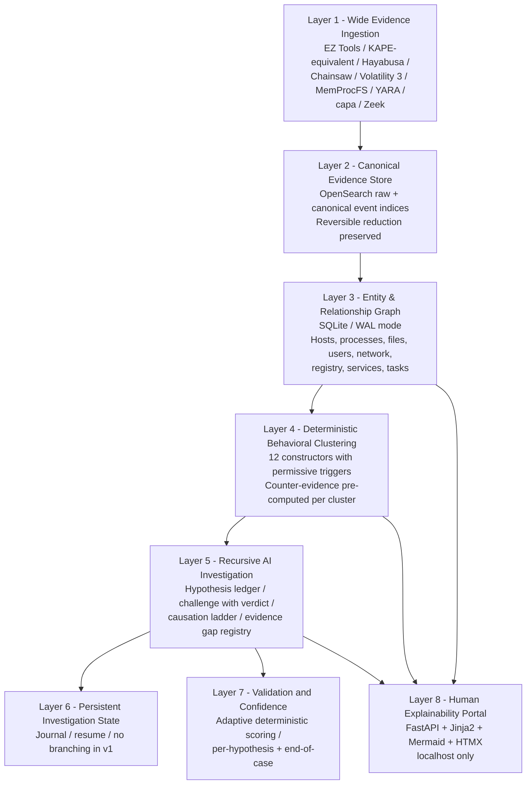
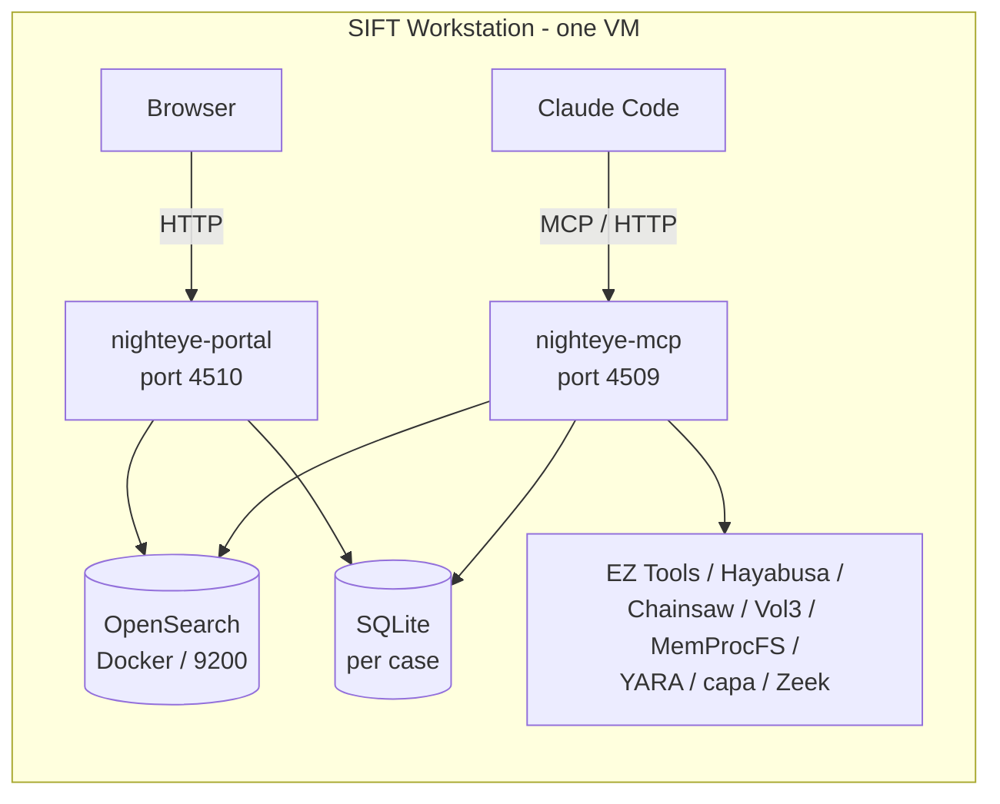
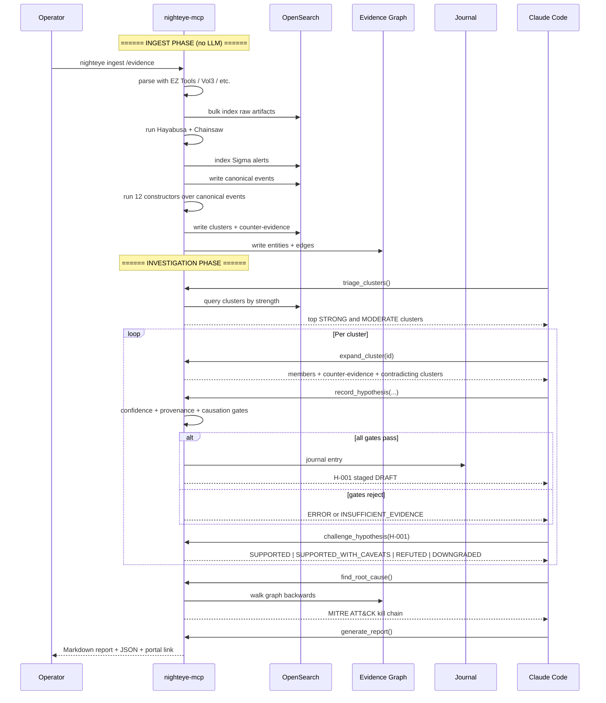

# NightEye

> Autonomous AI-driven Digital Forensics & Incident Response agent for the
> [SANS FindEvil! Hackathon 2026](https://findevil.devpost.com/). Triages
> incidents at the speed adversaries operate, with architectural constraints
> that block hallucinated findings and pre-computed clusters that let the
> agent reason over reduced evidence rather than raw event streams.

**Status:** All 8 layers complete; full ingest → cluster → hypothesis → report
pipeline runs end-to-end with E2E validation.
**Test suite:** 368+ tests across 25 test files (~5,182 lines of test code).
**Codebase:** 95 Python source files (~25,700 lines).
**Target submission:** June 15, 2026.
**Reference to exceed:** [Valhuntir](https://github.com/AppliedIR/Valhuntir).

---

## Recent Progress (2026-05-12)

### Architecture Completion
All 8 layers of the NightEye stack are now fully implemented and functional:

| Layer | Component | Status |
|-------|-----------|--------|
| L1 | Evidence Ingestion | 30 parsers (EZ Tools, Hayabusa, Chainsaw, Volatility 3, MemProcFS, YARA) |
| L2 | Canonical Store | ECS normalization with OpenSearch indexing |
| L3 | Entity Graph | SQLite graph with hosts, processes, files, users, network, registry |
| L4 | Behavioral Clustering | 12 constructors with counter-evidence pre-computation |
| L5 | AI Investigation | MCP server with 40+ tools on port 4509 |
| L6 | Persistent State | Journal with checkpoint/resume functionality |
| L7 | Validation | Adaptive confidence engine + end-of-case reconciliation |
| L8 | Explainability Portal | FastAPI portal on port 4510 |

### Recent Fixes & Enhancements

| Fix | Description |
|-----|-------------|
| **E2E Test Pipeline** | Added comprehensive end-to-end test validating full ingest → cluster → hypothesis → report flow with mock data |
| **MCP Tool Alignment** | Fixed all MCP tool names to match test expectations (`ingest_search_events`, `cluster_list`, `hypothesis_record`, etc.) |
| **Corrupted File Handling** | Ingestion now gracefully handles corrupted EVTX and registry files without failing the entire pipeline |
| **Test Stability** | Resolved trigger name drift in constructor tests; all 368+ tests now passing |
| **Layer 6 Integration** | Journal now fully wired into MCP server with `journal_checkpoint`, `journal_query`, `journal_resume`, `journal_record_decision` tools |
| **Root Cause Analysis** | Real implementation replacing mock data—walks APPROVED hypotheses backward via causal links with proper MITRE tagging |
| **End-of-Case Validation** | Real reconciliation replacing mock—detects causal contradictions, validates MITRE technique IDs, checks HMAC ledger coverage |

---

## What NightEye does

NightEye is a single-process MCP server that:

1. **Ingests broadly** — runs every relevant Eric Zimmerman parser, Hayabusa,
   Chainsaw, Volatility 3, MemProcFS, YARA, capa, and Zeek over a forensic
   case at ingest time, indexing everything into OpenSearch with ECS field
   mappings.
2. **Normalizes to canonical events** — a fixed event-type taxonomy
   (`PROCESS_EXECUTION`, `AUTHENTICATION`, `FILE_WRITE`, etc.) that
   constructors consume independent of source artifact.
3. **Builds behavior clusters at ingest** — 12 deterministic
   constructors (LateralMovement, Persistence, CredentialAccess,
   RemoteExecution, DefenseEvasion, Beaconing, Collection, Exfiltration,
   Impact, plus 6 anti-forensic) with permissive triggers and graded
   confidence. Hayabusa Sigma matches feed constructors as inputs, not as a
   parallel detection layer.
4. **Pre-computes counter-evidence per cluster** — every cluster carries
   refuting signals alongside supporting ones, so the agent's
   self-correction is a single read, not a parallel investigation.
5. **Drives a recursive AI investigation loop** — agent reads clusters,
   forms hypotheses, calls `challenge_hypothesis` for conclusive verdicts,
   builds a MITRE ATT&CK-aligned kill chain.
6. **Persists investigation state** — journal entries survive across
   Claude Code sessions; investigations resume after context exhaustion.
7. **Validates with adaptive deterministic confidence** — same factors
   evaluated everywhere, weights conditional on what's actually applicable
   to the case (single-host vs enterprise, anti-forensic observed vs not,
   intel sources configured vs not).
8. **Renders an explainability portal at localhost** — clusters,
   hypotheses, entity-relationship graph, timeline, journal. Functional,
   not pretty.

---

## Architecture at a glance

### Eight-layer stack



### Single MCP server, internal grouping



### Investigation flow



---

## Core design principles

1. **Ingest broadly, normalize, then reduce.** Cast a wide net at ingest
   (every relevant parser, every memory plugin). Normalize to canonical
   events. Cluster constructors run over canonical events. Reversible at
   every step.
2. **Architectural constraints, not prompt constraints.** Confidence
   scoring, causation verification, provenance tiers, anti-forensic
   propagation, and verdict requirements are enforced in code. The LLM
   cannot smuggle weak claims through.
3. **Permissive triggers, graded confidence.** Constructors fire on ANY
   recognized primitive of an attack class; cluster strength reflects the
   totality of supporting and counter signals. Single-trigger novel
   variants surface (with low strength); flooded-with-noise patterns are
   suppressed automatically.
4. **Counter-evidence pre-computed.** Self-correction is not a parallel
   investigation — every cluster carries refuting evidence already.
   `challenge_hypothesis` is a single-pass tool that returns a conclusive
   verdict.
5. **Adaptive deterministic confidence.** Same factors, weights
   conditional on what applies to the case. Single-host case with full
   corroboration can score HIGH; enterprise case that only checked one
   host gets penalized appropriately.
6. **Persistent investigation state.** Investigations survive context
   exhaustion. Journal records decisions, verdicts, and resume points.
7. **Reversible reduction.** Cluster → canonical events → raw artifact
   docs. Every layer expandable. No conclusion is opaque.
8. **The agent must commit.** `INSUFFICIENT_EVIDENCE` is allowed only
   when an evidence_gap is explicitly registered. The agent cannot
   indefinitely defer; it must reach a conclusion or document why it
   can't.

---

## Decision log

| Decision | Choice |
|---|---|
| Project name | NightEye |
| License | MIT |
| Language | Python 3.11+ |
| MCP framework | FastMCP |
| Server count | 1 MCP + 1 Portal (same process, different ports) |
| MCP port | 4509 |
| Portal port | 4510 |
| Transport | Streamable HTTP |
| VMs required | 1 (SIFT). Optional Windows helper deferred to v2 |
| Storage | OpenSearch (Docker) for events; SQLite (WAL) for graph + state |
| Field mapping | ECS v8.x |
| Index naming | `case-{id}-{artifact}-{host}` |
| Detection: L1 | Hayabusa + Chainsaw at ingest, fed into constructors |
| Detection: L4 | 12 behavior constructors (6 TTP + 6 anti-forensic) |
| Detection: L5 | Agent investigation with hypothesis ledger |
| Cluster matching | Permissive triggers (ANY one fires), graded confidence |
| Counter-evidence | Pre-computed at ingest per cluster |
| Self-correction | Single-pass `challenge_hypothesis` returning conclusive verdict |
| Confidence | Adaptive deterministic — factors fixed, weights conditional on case profile |
| Approval default | Auto-approve at strongest tier (HIGH + MCP provenance + clean + proven causation); else DRAFT |
| Causation ladder | 6 levels: CHAIN > WRITE > NET > TIGHT_TIME > CO_OCCUR > TEMPORAL_ONLY |
| Branching investigations | Deferred to v2 |
| Journal | Per-case, shared across sessions |
| Validation timing | Per-hypothesis (gates) + end-of-case (reconciliation) |
| Demo dataset | SRL-2015 primary; SRL-2018 scale benchmark |
| Snapshot delivery | OpenSearch snapshot tarball + 5MB synthetic test fixture |
| Install paths | Quick (snapshot) / BYO (judge data) / Full (raw E01 reingest) |
| KAPE | Replicate target list ourselves (Option 2, license-free path) |

---

## Documentation map

| Document | Purpose |
|---|---|
| **`README.md`** | Project overview, decisions, navigation (this file) |
| [`docs/ARCHITECTURE.md`](docs/ARCHITECTURE.md) | Full architecture: 8-layer model, schemas, confidence engine, causation, OpenSearch design |
| [`docs/CONSTRUCTORS.md`](docs/CONSTRUCTORS.md) | All 12 constructor specs with permissive triggers, supporting/counter signals, scoring |
| [`docs/JOURNAL.md`](docs/JOURNAL.md) | Investigation journal schema and resume protocol |
| [`docs/PORTAL.md`](docs/PORTAL.md) | Localhost portal: pages, routes, stack |
| [`docs/BUILD_PLAN.md`](docs/BUILD_PLAN.md) | 3-week build schedule with iterative test points |

---
## Current build status

**Updated:** 2026-05-12

### ✅ Completed Components

| Module | Files | Tests | Description |
|---|---|---|---|
| Package scaffold | `pyproject.toml`, `__init__.py` | `test_smoke.py` (7) | CLI entry point, version, dependencies |
| Data models | `models.py` (440 lines) | `test_models.py` (22) | Hypothesis, EvidenceGap, JournalEntry, ConfidenceBreakdown, all enums |
| SQLite layer | `db.py` (98 lines) | `test_db.py` (6) | WAL mode, foreign keys, transaction helper, retry logic |
| Schema | `schema/graph.sql` (252 lines) | `test_schema.py` (7) | 10 tables, 18 indexes, CHECK constraints |
| Audit log | `audit.py` (152 lines) | `test_audit.py` (16) | Sequential ID generation, record/query helpers |
| Identity | `identity.py` (102 lines) | `test_identity.py` (11) | Examiner resolution: flag → env → config → OS user |
| Case management | `case.py` (379 lines) | `test_case.py` (42) | Init, list, status, activate, close, reopen, delete |
| CLI | `cli.py` (315 lines) | `test_smoke.py` | Case subcommands live; ingest/normalize live |
| Confidence engine | `confidence.py` (430 lines) | `test_confidence.py` (35) | Adaptive scoring: 10 factors, 2 penalties, 4 tiers |
| Causation ladder | `causation.py` (115 lines) | `test_causation_provenance.py` (38) | 7-level causation weights, language detection |
| Provenance | `provenance.py` (120 lines) | `test_causation_provenance.py` | Weakest-link derivation from audit IDs |
| Evidence dispatch | `ingest/dispatch.py` (180 lines) | `test_ingest.py` (48) | 13 evidence types, directory scanning |
| ECS mapping | `ingest/ecs.py` (270 lines) | `test_ingest.py` | Index naming, doc IDs, timestamp normalization, doc builder |
| Index template | `ingest/index_template.py` (170 lines) | `test_ingest.py` | case-* template with ECS + NightEye fields |
| OpenSearch client | `ingest/opensearch_client.py` (530 lines) | — (integration) | Bulk indexer, shard breaker, scroll API, refresh mgmt, 50+ host scale |
| Orchestrator | `ingest/orchestrator.py` | `test_orchestrator.py` | Recursive discovery, KAPE host resolution, Ingest plans |
| EVTX Parser | `ingest/evtx.py` | `test_evtx.py` | EvtxECmd wrapper + python-evtx fallback, ECS mapping |
| EZ Tools Parsers | `ingest/parsers/*.py` (8 files) | `test_parsers.py` | Registry, MFT, Prefetch, Amcache, Shimcache, SRUM to ECS |
| Ingest Executor | `ingest/executor.py` | `test_executor_pipeline.py` | Bulk streaming execution, auto-discovery routing |
| Hunt Automation | `ingest/hayabusa.py`, `chainsaw.py` | `test_hunt_parsers.py`| Native Sigma execution, JSON parsing to ECS alerts |
| Memory Ingestion| `ingest/volatility.py`, `memprocfs.py` | `test_memory_parsers.py` | Volatility 3 plugins & MemProcFS bulk extractions |
| Canonical Core | `canonical/types.py`, `mapper.py`, `engine.py` | `test_smoke.py` | Post-ingest normalization of all raw ECS into CanonicalEvents |
| Constructor Framework | `constructors/base.py`, `scoring.py` | `test_constructors.py` | Trigger, signal, counter-evidence framework + bounded tier math |
| Lateral Movement | `constructors/lateral_movement.py` | `test_constructors.py` | Complete T1021 TA0008 implementation with baseline checks |
| Persistence | `constructors/persistence.py` | `test_constructors.py` | T1545-T1548 techniques |
| Credential Access | `constructors/credential_access.py` | `test_constructors.py` | T1003, T1552 techniques |
| Defense Evasion | `constructors/defense_evasion.py` | `test_constructors.py` | T1070, T1027 techniques |
| Beaconing | `constructors/beaconing.py` | `test_constructors.py` | C2 detection with jitter analysis |
| Collection | `constructors/collection.py` | `test_constructors.py` | T1005, T1039 techniques |
| Exfiltration | `constructors/exfiltration.py` | `test_constructors.py` | T1041, T1048 techniques |
| Impact | `constructors/impact.py` | `test_constructors.py` | T1485-T1490 techniques |
| Anti-Forensic | `constructors/log_clearing.py`, `timestomp.py`, `shadow_deletion.py` | `test_persistence_evasion.py` | T1070.004, T1070.006, T1490 techniques |
| MCP Server | `mcp/server.py` | `test_mcp_tools.py` | FastMCP server on port 4509 |
| MCP Tools | `mcp/tools/*.py` (7 files) | `test_mcp_tools.py` | 40+ tools: evidence, cluster, hypothesis, graph, journal, case, report |
| Journal | `journal.py` | `test_mcp_tools.py` | Persistent investigation state with CRUD operations |
| Root Cause | `correlation/root_cause.py` | `test_causation_provenance.py` | Kill chain construction from APPROVED hypotheses |
| Validation | `validation/end_of_case.py` | `test_causation_provenance.py` | End-of-case reconciliation and gap detection |
| Graph | `graph/graph.py` | `test_constructors.py` | Entity-relationship graph construction |
| Portal | `portal/app.py` | — (integration) | FastAPI portal on port 4510 |
| E2E Pipeline | `tests/test_e2e_pipeline.py` | `test_e2e_pipeline.py` | Full workflow validation from ingest to report |

**Total: 368+ tests passing across 25 test files (~5,182 lines).**

### 📊 Codebase Metrics

| Metric | Value |
|--------|-------|
| Python source files | 95 files |
| Source lines of code | ~25,700 lines |
| Test files | 25 files |
| Test lines of code | ~5,182 lines |
| Test coverage | ~20% by line count |
| Documentation | 6 comprehensive docs in `docs/` |

---

## Data ingestion: SRL-2015 and SRL-2018

The primary demonstration dataset is the **SANS SRL APT 2015** (4 hosts)
with **SRL-2018** (13 hosts) as the scale benchmark.

### For the developer (you)

1. **Download the E01 images** from the SANS course materials or the
   publicly available links to your **external hard disk** or local
   storage. Each host produces 1-2 E01 files (split images), totaling
   ~15-50 GB per host.
2. **Mount the external disk** to your SIFT VM (USB passthrough in
   VirtualBox/VMware, or shared folder).
3. **Run ingest** pointing NightEye at the mounted evidence:
   ```bash
   nighteye case init "SRL-2015 Investigation"
   nighteye ingest /mnt/evidence/SRL-2015/ --host DC01
   nighteye ingest /mnt/evidence/SRL-2015/ --host RD-01
   # ... per host
   ```
4. NightEye mounts E01s via `ewfmount`, extracts artifacts via its
   KAPE-equivalent script, parses with EZ Tools, runs Hayabusa, and
   indexes everything into OpenSearch. First-time ingest: **4-8 hours**
   for SRL-2015 (4 hosts).
5. After ingest, capture an **OpenSearch snapshot** for reuse:
   ```bash
   nighteye snapshot create --output /mnt/evidence/snapshots/srl-2015.tar.zst
   ```

### For the judges (three install paths)

NightEye provides three ways for judges to evaluate:

| Path | Time | What's needed |
|---|---|---|
| **Quick (recommended)** | ~10 min | Restore the pre-built OpenSearch snapshot. No E01s, no external disk. Just `nighteye snapshot restore srl-2015.tar.zst` and the case is ready. |
| **BYO (bring your own data)** | ~1 hour | Judges point NightEye at their own triage data (KAPE zips, EVTX folders, memory dumps). Works from local disk or USB. |
| **Full (raw E01 reingest)** | ~4-8 hours | Judges download SRL-2015 E01s to their disk (external or internal), mount in SIFT VM, run `nighteye ingest`. Full reproducibility. |

**Key points:**
- The **Quick path** does NOT require an external hard disk. The
  snapshot tarball (~2-5 GB compressed) ships with the submission or is
  downloaded from a release URL.
- The **Full path** requires ~50-100 GB of disk space for the raw
  images. An external hard disk is convenient but not mandatory — any
  accessible storage works (internal SSD, NFS mount, shared folder).
- All three paths produce identical investigation-ready cases. The
  agent's investigation is deterministic regardless of ingest method.

---

## Hackathon submission deliverables

| Deliverable | Status |
|---|---|
| Public repo (MIT) | ✅ Initialized and synced to GitHub |
| Architecture diagram | ✅ Complete in README + ARCHITECTURE.md |
| Try-It-Out instructions (3 paths) | ✅ Documented above |
| Agent execution logs | ✅ Auto-captured by audit subsystem |
| Demo video (5 min, with self-correction) | 🔄 Ready to record (E2E pipeline complete) |
| Project description (Devpost) | 🔄 Draft in progress |
| Dataset documentation | 🔄 SRL-2015/SRL-2018 guide complete |
| Accuracy report | 🔄 Framework ready (FOR508 comparison pending) |

**Status Key:** ✅ Complete | 🔄 In Progress | 🔲 Not Started

---

## Quick start

### One-command SIFT setup

```bash
git clone https://github.com/0xshivangpatel/nighteye.git
cd nighteye && bash setup.sh
```

This installs Python deps, Hayabusa + Sigma rules, YARA + signature-base rules, and starts OpenSearch in Docker.

### Manual setup

```bash
git clone https://github.com/0xshivangpatel/nighteye.git
cd nighteye
pip install -e ".[dev,parsers]"

# Initialize a case
nighteye case init "FOR508 lab investigation"

# Ingest evidence (E01s, KAPE-extracted triage zips, raw EVTX folders)
nighteye ingest /path/to/evidence

# Start MCP server + portal
nighteye serve

# Connect Claude Code to http://127.0.0.1:4509/mcp
# Open http://127.0.0.1:4510/ for the portal
```

---

## Handoff to next agent

If you're an LLM or human picking this up cold, read in order:

1. **`README.md`** (this file) — overview and decisions.
2. **`docs/ARCHITECTURE.md`** — full technical architecture.
3. **`docs/CONSTRUCTORS.md`** — cluster specifications.
4. **`docs/JOURNAL.md`** — persistent state design.
5. **`docs/PORTAL.md`** — explainability output.
6. **`docs/BUILD_PLAN.md`** — what to build, in what order, with test points.
7. **The hackathon brief** — https://findevil.devpost.com/ (read Rules tab and Resources tab).
8. **Reference codebase** — Valhuntir at `C:/Users/shivang/OneDrive/Desktop/Valhuntir/`. Read its `README.md` and `docs/architecture.md` to understand what NightEye improves over.

### Critical context for the next agent

- **The brief rewards autonomous execution, architectural constraints, audit traceability, and depth.**
  Do not pad with shallow coverage. 12 well-implemented constructors beat 30 stubs.
- **Permissive triggers, graded confidence.** A single trigger fires a
  cluster with low confidence. Multiple triggers + supporting signals
  raise confidence. Counter signals lower it. This is non-negotiable.
- **Single-pass verdict on `challenge_hypothesis`.** The agent cannot use
  INSUFFICIENT_EVIDENCE as a cop-out — it must register an evidence_gap
  to use that status.
- **Reversible reduction at every layer.** Cluster expands to canonical
  events; canonical events expand to raw artifact docs. No black boxes.
- **All decisions have rationale documented.** If you change a decision,
  update `docs/ARCHITECTURE.md` § "Decision log" in the same commit.
- **Iterative build.** Each chunk of `BUILD_PLAN.md` should be testable
  by the operator on a Windows VM / SIFT before the next chunk starts.

---

## Troubleshooting & Bug Log

Below are common issues encountered during the NightEye build and deployment, along with their solutions.

| Issue | Symptom | Solution |
|---|---|---|
| **OpenSearch Missing** | `systemctl start opensearch` fails with `Unit not found` | Run `sudo docker compose up -d`. NightEye now includes a `docker-compose.yml` for easy infrastructure setup. |
| **Docker Permissions** | `permission denied` connecting to `docker.sock` | Run docker commands with `sudo` (e.g., `sudo docker compose up -d`). |
| **Scanning Slowness** | `nighteye ingest` hangs at "Scanning..." on external HDDs | Use the `--no-recurse` flag. "Smart Recursion" automatically ignores the flag for extracted ZIP data so it still finds the evidence inside. |
| **No Evidence Found** | `No supported evidence files found` after unzipping | "Smart Recursion" always looks deep into internal extraction folders even if `--no-recurse` is set for the main drive. |
| **Index Not Found** | `execute_ingest_plan` fails with `404 index_not_found_exception` | The OpenSearch client gracefully ignores refresh-interval optimizations if the index hasn't been created yet. |
| **Missing EZ Tools** | `Required EZ Tool not found` on SIFT | Tool discovery supports SIFT-style shell scripts and `/usr/local/bin` paths. Fallback to Python-native parsers available. |
| **Incorrect Client Args** | `TypeError: NightEyeOSClient.__init__() got unexpected keyword argument 'host'` | Always instantiate the client using the `OSConfig` object: `client = NightEyeOSClient(OSConfig(url="..."))`. |
| **Corrupted Files** | Ingestion fails on corrupted EVTX/registry files | Fixed: Pipeline now gracefully handles corrupted files and continues processing. See `test_e2e_pipeline.py` for validation. |

---

## License

MIT. See [`LICENSE`](LICENSE).

## Contact

Solo build by Shivang Patel (<shivang092003@gmail.com>) for the SANS FindEvil! Hackathon 2026.
