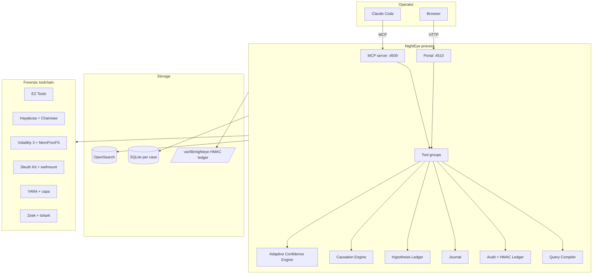
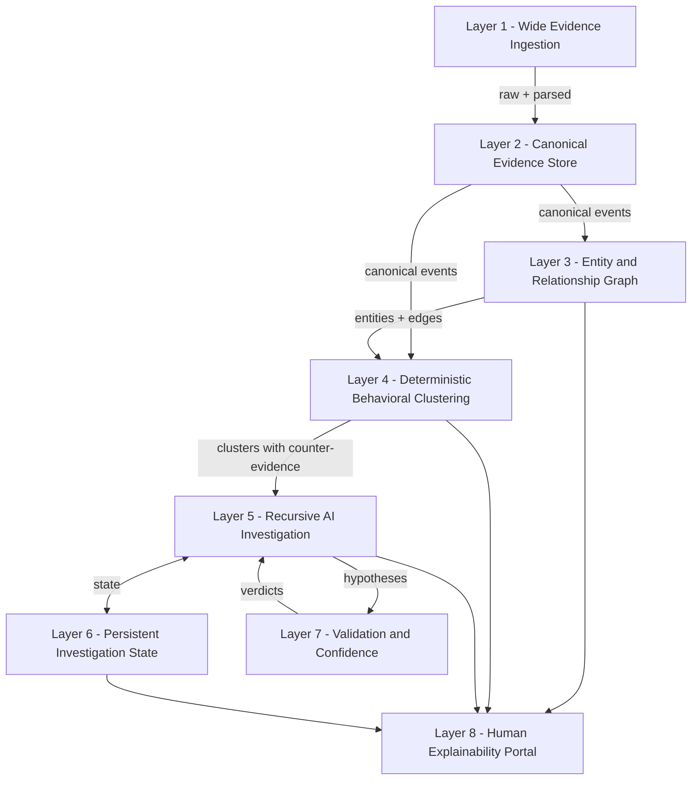
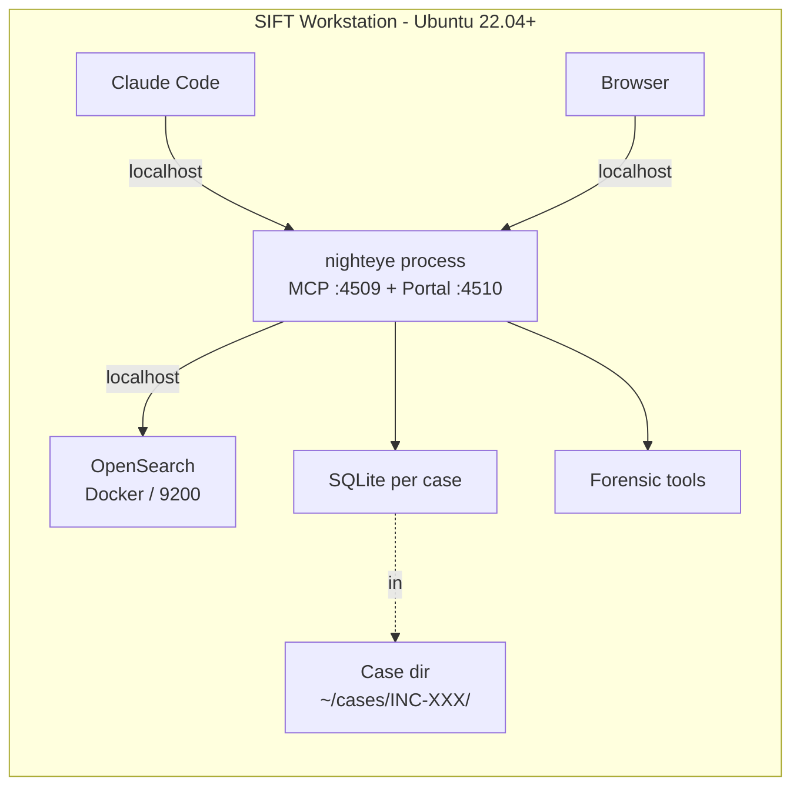
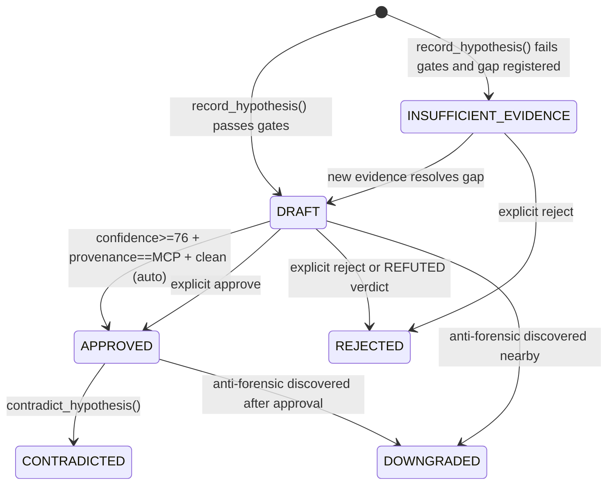

# NightEye — Architecture

Source of truth for technical design. Update in the same commit as any
implementation that diverges.

## Table of contents

1. [System overview](#1-system-overview)
2. [Eight-layer stack](#2-eight-layer-stack)
3. [Deployment topology](#3-deployment-topology)
4. [MCP server design](#4-mcp-server-design)
5. [Layer 1: Wide ingestion](#5-layer-1-wide-ingestion)
6. [Layer 2: Canonical evidence store](#6-layer-2-canonical-evidence-store)
7. [Layer 3: Entity & relationship graph](#7-layer-3-entity--relationship-graph)
8. [Layer 4: Behavioral clustering](#8-layer-4-behavioral-clustering)
9. [Layer 5: Recursive AI investigation](#9-layer-5-recursive-ai-investigation)
10. [Layer 6: Persistent investigation state](#10-layer-6-persistent-investigation-state)
11. [Layer 7: Validation and confidence](#11-layer-7-validation-and-confidence)
12. [Layer 8: Explainability portal](#12-layer-8-explainability-portal)
13. [OpenSearch index design and ECS mapping](#13-opensearch-index-design-and-ecs-mapping)
14. [Audit log and HMAC ledger](#14-audit-log-and-hmac-ledger)
15. [Configuration](#15-configuration)
16. [Failure handling and circuit breakers](#16-failure-handling-and-circuit-breakers)
17. [Open decisions](#17-open-decisions)

---

## 1. System overview

NightEye is a single-process MCP server on a SIFT workstation, paired with
a localhost portal served from the same Python runtime. It connects an
LLM client (Claude Code primary) to a forensic toolchain via the Model
Context Protocol over Streamable HTTP.



---

## 2. Eight-layer stack



| Layer | Responsibility | Token cost |
|---|---|---|
| L1 Ingest | Parse every artifact with native tooling, run Hayabusa/Chainsaw, extract memory artifacts | 0 |
| L2 Canonical store | Normalize raw events to a fixed canonical event taxonomy; index both raw and canonical | 0 |
| L3 Graph | Maintain entities (host/process/file/user/network/registry/service/task) and edges (spawned_by/wrote/connected_to/etc.) in SQLite | 0 |
| L4 Clustering | Run 12 constructors over canonical events; pre-compute clusters with supporting + counter signals | 0 |
| L5 AI investigation | Agent reads clusters, forms hypotheses, calls `challenge_hypothesis` for verdicts, builds kill chain | All tokens are spent here |
| L6 Persistent state | Record agent decisions, hypothesis transitions, journal entries; survive context exhaustion | 0 |
| L7 Validation | Adaptive deterministic confidence + causation gates; per-hypothesis + end-of-case | 0 |
| L8 Portal | Render clusters, hypotheses, graph, timeline, journal, audit at localhost | 0 |

---

## 3. Deployment topology

### Required: single SIFT VM



This is the default path. Demo runs on this.

### Optional add-ons (deferred to v2 unless time permits)

- **Windows helper VM** — for live remote triage with Sysinternals. Not
  needed for E01-only analysis.
- **Dedicated OpenSearch host** — for >25 host scale where co-located OS
  competes with Volatility for memory.

### Networking

- All required components: localhost only.
- OpenSearch: `127.0.0.1:9200`.
- NightEye MCP: `127.0.0.1:4509`.
- NightEye portal: `127.0.0.1:4510`.
- No SSH between VMs. No SMB. No bearer tokens between hosts in default
  profile.

---

## 4. MCP server design

### One process, internal grouping

```python
# Pseudocode showing FastMCP layout
from mcp.server.fastmcp import FastMCP

mcp = FastMCP("nighteye", port=4509)

# Tool naming convention: {group}_{verb}
# Groups (cognitive only - same process):
#   ingest_     : ingestion, parsing, normalization
#   triage_     : entry-point cluster surfacing
#   query_      : domain primitives over OpenSearch and graph
#   expand_     : reverse-traversal: cluster -> events -> raw
#   record_     : hypothesis lifecycle
#   challenge_  : adversarial review
#   correlate_  : cross-host, lineage, causation
#   case_       : case management
#   journal_    : persistent state
#   report_     : reporting
```

### Why one server, not many

| Concern | One server | Many servers |
|---|---|---|
| Setup time for judges | one install | many installs / orchestrate |
| Inter-server coordination | none | bearer tokens, gateway proxy, audit per backend |
| Failure modes | one process | N times start order, port conflict, auth |
| Multi-team development | irrelevant for hackathon | reasonable for product |
| Domain isolation | logical (tool prefix) | physical (process) |

### Concurrency model

- All tools are `async def`.
- Long-running ingest jobs run as background `asyncio.Task`s; agent polls
  `ingest_status(job_id)`.
- Per-tool timeouts: 30s queries, 1h ingest, 5min cluster expansion.
- SQLite WAL mode for concurrent reads.
- OpenSearch via `opensearch-py` async client.

### MCP protocol details

- **Transport:** Streamable HTTP per MCP spec.
- **Tools:** ~40 (final count after constructor implementation; see
  `BUILD_PLAN.md`).
- **Resources:** none in v1.
- **Server instructions:** ~2,000 chars summarizing groups, gates, and
  layering, sent at session init.

---

## 5. Layer 1: Wide ingestion

Cast a wide net at ingest. Reduce later. Inputs supported:

- E01 disk images (mounted via `ewfmount` + `mmls`)
- KAPE-extracted triage zips
- Raw EVTX folders
- Memory dumps (.mem, .raw, .vmem, .bin)
- PCAP files

### Disk artifacts via Eric Zimmerman tools

| Tool | Parses |
|---|---|
| `AmcacheParser` | Amcache.hve |
| `AppCompatCacheParser` | SYSTEM hive Shimcache |
| `EvtxECmd` | All `*.evtx` files |
| `JLECmd` | Jump Lists |
| `LECmd` | `.lnk` files |
| `MFTECmd` | `$MFT`, `$J`, `$LogFile`, `$Boot`, `$SDS` |
| `PECmd` | Prefetch |
| `RBCmd` | `$Recycle.Bin` |
| `RECmd` | All registry hives (NTUSER.DAT, SOFTWARE, SYSTEM, SECURITY, SAM, COMPONENTS, Amcache, USRCLASS) |
| `SBECmd` | Shellbags |
| `SQLECmd` | App SQLite databases |
| `SrumECmd` | SRUM |
| `WxTCmd` | Windows Timeline (ActivitiesCache.db) |
| `bstrings` | Selective binary strings |

EZ Tools are .NET; we run them on Linux via `dotnet` or `mono`.

### KAPE-equivalent collection (Option 2)

We replicate the KAPE `!SANS_Triage` target list ourselves with a
controlled extraction script. From a mounted E01:

1. Walk `\Windows\System32\winevt\Logs\` → all `*.evtx` to staging
2. Walk registry hive paths → `NTUSER.DAT`, `SOFTWARE`, `SYSTEM`,
   `SECURITY`, `SAM`, `Amcache.hve`, etc.
3. Walk `\$MFT`, `\$J`, `\$LogFile`, `\$Boot` from NTFS root
4. Walk `\Windows\Prefetch\` → `*.pf`
5. Walk `\Users\*\AppData\Roaming\Microsoft\Windows\Recent\AutomaticDestinations\` → Jump Lists
6. Walk `\Users\*\AppData\Local\Microsoft\Windows\WebCache\` → browser cache
7. Walk `\Windows\System32\Tasks\*` → Scheduled Tasks XML
8. Etc.

Then route each artifact to the right EZ Tool parser. License-free.

### Detection engines at ingest

| Engine | Input | Indexed as |
|---|---|---|
| Hayabusa | Parsed EVTX | `case-X-hayabusa-{host}` |
| Chainsaw | Parsed EVTX | `case-X-chainsaw-{host}` (cross-validation) |
| YARA | Selective files + memory | `case-X-yara-{host}` |
| capa | PE binaries | `case-X-capa-{host}` |

Hayabusa applies ~3,700 Sigma rules. Chainsaw covers a slightly different
set; running both reduces false-negative risk by ~5%.

### Memory analysis

| Tool | Use |
|---|---|
| MemProcFS | Mount memory dump as filesystem; bulk extract registry, files, processes |
| Volatility 3 | Deep analysis via plugins |

Volatility 3 plugins indexed:

| Family | Plugins |
|---|---|
| Process | `pslist`, `pstree`, `psscan` |
| Network | `netscan`, `netstat` |
| Modules | `dlllist`, `ldrmodules` |
| Injection | `malfind`, `vadinfo` |
| Handles | `handles` |
| Services | `svcscan` |
| Drivers | `driverscan` |
| Credentials | `hashdump`, `cachedump`, `lsadump` |
| Strings | `cmdline`, `environ` |
| YARA | `yarascan` |
| Registry | `hivelist`, `printkey` |

### Network artifacts

If PCAP available:

- `tshark` for protocol decode
- `Zeek` for analytics → `conn.log`, `dns.log`, `http.log`, `ssl.log`,
  `files.log`, `x509.log`

Indexed as `case-X-zeek-{type}-{host}`.

If no PCAP: fall back to Sysmon 3 from EVTX (already indexed).

### Document/email artifacts (light coverage)

- Outlook PST/OST via `libpff` → attachment metadata
- IIS logs / Apache logs via standard log parsers

Cheap to add; common attack vectors. v1.

### Linux artifact ingestion (deferred)

If a host is Linux: `auth.log`, `syslog`, `bash_history`, `.ssh/*`,
`/etc/cron.*`, systemd timers, `/var/log/audit/audit.log`. Deferred
to v2 unless demo dataset includes Linux.

### Volume estimates (SRL-2018, 13 hosts)

| Source | Approximate docs |
|---|---|
| EVTX | 65-200M |
| MFT | 13-40M |
| Registry parsed entries | 2-5M |
| Amcache / Shimcache / Prefetch | 200-500K |
| Memory (Vol3 plugins, 22 dumps) | 1-3M |
| Hayabusa + Chainsaw alerts | 10-50K |
| Network (if PCAP) | varies |

Total: 80-250M docs. Indices ~100-200 GB. Ingest first time: 4-8 hours.
Pre-baked snapshot avoids this for judges.

---

## 6. Layer 2: Canonical evidence store

After raw indexing, a normalization pass writes canonical events to
`case-X-canonical-{host}`. Constructors consume canonical events
exclusively.

### Canonical event taxonomy (fixed)

```
PROCESS_EXECUTION         PROCESS_TERMINATION
PROCESS_INJECTION         AUTHENTICATION
PRIVILEGE_USE             FILE_WRITE
FILE_READ                 FILE_DELETE
REGISTRY_MODIFY           REGISTRY_DELETE
SERVICE_INSTALL           SERVICE_MODIFY
SCHEDULED_TASK_CREATE     SCHEDULED_TASK_MODIFY
WMI_SUBSCRIPTION          NETWORK_CONNECTION
NETWORK_LISTEN            DNS_QUERY
DLL_LOAD                  MEMORY_ALLOC_RWX
LSASS_ACCESS              TICKET_REQUEST
REPLICATION               LOG_CLEARED
SHADOW_DELETED            DEFENDER_EXCLUSION_ADDED
USER_CREATED              USER_PRIVILEGE_GRANT
```

### Canonical event schema

```python
{
    "@timestamp": "2026-04-29T14:23:07.412Z",
    "canonical_type": "AUTHENTICATION",
    "host": {"name": "DC01", "os": "Windows Server 2008 R2"},
    "user": {"name": "admin", "domain": "stark", "id": "S-1-5-21-..."},
    "process": {"name": "lsass.exe", "pid": 612},  # if applicable
    "source": {"ip": "10.3.58.5"},                 # if applicable
    "destination": {"ip": "10.3.58.4"},            # if applicable
    "outcome": "success",
    "details": {"logon_type": 3, "auth_package": "Kerberos"},
    "nighteye": {
        "ingest_id": "nighteye-shivang-20260429-001",
        "source_indices": ["case-X-evtx-DC01"],
        "source_doc_ids": ["sha256:..."],     # back-reference to raw
        "parser": "evtxecmd",
        "parser_version": "1.5.2.0"
    }
}
```

### Reversible reduction

Cluster → canonical event → raw artifact doc.

`expand_cluster(cluster_id)` returns canonical events.
`expand_canonical(event_id)` returns raw artifact docs.

The agent can drill down at any layer if a cluster's surface looks
suspect.

---

## 7. Layer 3: Entity & relationship graph

SQLite database, one per case, `{case_dir}/graph.db`, WAL mode.

### Schema

```sql
CREATE TABLE entities (
    entity_id          TEXT PRIMARY KEY,         -- sha256(case_id + type + canonical_key)
    entity_type        TEXT NOT NULL,            -- host|process|file|user|network|registry|service|task
    case_id            TEXT NOT NULL,
    canonical_key      TEXT NOT NULL,            -- natural identifier
    properties         TEXT NOT NULL,            -- JSON, type-specific
    first_seen         TEXT NOT NULL,            -- ISO8601 UTC
    last_seen          TEXT NOT NULL,
    seen_count         INTEGER NOT NULL DEFAULT 1,
    evidence_disturbed INTEGER NOT NULL DEFAULT 0,
    created_at         TEXT NOT NULL,
    CHECK (entity_type IN ('host','process','file','user',
                           'network','registry','service','task'))
);
CREATE INDEX idx_entities_case_type ON entities(case_id, entity_type);
CREATE INDEX idx_entities_canonical ON entities(case_id, canonical_key);
CREATE INDEX idx_entities_lastseen  ON entities(last_seen);

CREATE TABLE edges (
    edge_id          TEXT PRIMARY KEY,           -- sha256(from + to + type + ts)
    from_entity      TEXT NOT NULL,
    to_entity        TEXT NOT NULL,
    edge_type        TEXT NOT NULL,
    case_id          TEXT NOT NULL,
    timestamp        TEXT NOT NULL,
    properties       TEXT,                       -- JSON
    source_audit_id  TEXT NOT NULL,
    confidence_basis TEXT NOT NULL,              -- mcp|hook|shell|parsed_artifact
    created_at       TEXT NOT NULL,
    CHECK (edge_type IN ('spawned_by','wrote','connected_to',
                         'authenticated_as','persists_via','modified',
                         'loaded','accessed','signed_by')),
    FOREIGN KEY (from_entity) REFERENCES entities(entity_id),
    FOREIGN KEY (to_entity)   REFERENCES entities(entity_id)
);
CREATE INDEX idx_edges_from      ON edges(from_entity, edge_type);
CREATE INDEX idx_edges_to        ON edges(to_entity, edge_type);
CREATE INDEX idx_edges_timestamp ON edges(timestamp);
CREATE INDEX idx_edges_case_type ON edges(case_id, edge_type);

CREATE TABLE evidence_disturbances (
    disturbance_id    TEXT PRIMARY KEY,
    case_id           TEXT NOT NULL,
    host              TEXT NOT NULL,
    window_start      TEXT NOT NULL,
    window_end        TEXT NOT NULL,
    disturbance_type  TEXT NOT NULL,
    detected_by       TEXT NOT NULL,
    source_audit_id   TEXT NOT NULL,
    details           TEXT,
    created_at        TEXT NOT NULL
);
CREATE INDEX idx_disturbances_host_time ON evidence_disturbances(host, window_start, window_end);

CREATE TABLE case_capabilities (
    case_id                       TEXT PRIMARY KEY,
    host_count                    INTEGER NOT NULL,
    artifact_types                TEXT NOT NULL,
    has_memory                    INTEGER NOT NULL,
    has_network                   INTEGER NOT NULL,
    has_intel_source              INTEGER NOT NULL,
    anti_forensic_observed        INTEGER NOT NULL DEFAULT 0,
    time_window_hours             INTEGER,
    profiled_at                   TEXT NOT NULL
);

CREATE TABLE clusters (
    cluster_id           TEXT PRIMARY KEY,
    case_id              TEXT NOT NULL,
    cluster_type         TEXT NOT NULL,
    strength             TEXT NOT NULL,           -- STRONG|MODERATE|WEAK|NOISE
    score                INTEGER NOT NULL,
    triggers_fired       TEXT NOT NULL,           -- JSON list
    supporting_signals   TEXT NOT NULL,           -- JSON list
    counter_signals      TEXT NOT NULL,           -- JSON list
    contradicting_clusters TEXT,                  -- JSON list of cluster_ids
    member_canonical_ids TEXT NOT NULL,           -- JSON list of canonical event IDs
    primary_host         TEXT,
    primary_user         TEXT,
    time_start           TEXT NOT NULL,
    time_end             TEXT NOT NULL,
    technique_ids        TEXT,                    -- JSON list of MITRE T-IDs
    mitre_tactic         TEXT,
    summary              TEXT NOT NULL,
    created_at           TEXT NOT NULL,
    CHECK (strength IN ('STRONG','MODERATE','WEAK','NOISE'))
);
CREATE INDEX idx_clusters_case_strength ON clusters(case_id, strength);
CREATE INDEX idx_clusters_type          ON clusters(case_id, cluster_type);
CREATE INDEX idx_clusters_time          ON clusters(time_start, time_end);

CREATE TABLE hypotheses (
    hypothesis_id          TEXT PRIMARY KEY,
    case_id                TEXT NOT NULL,
    examiner               TEXT NOT NULL,
    title                  TEXT NOT NULL,
    observation            TEXT NOT NULL,
    interpretation         TEXT NOT NULL,
    technique_ids          TEXT NOT NULL,
    status                 TEXT NOT NULL,
    staged_at              TEXT NOT NULL,
    modified_at            TEXT NOT NULL,
    approved_at            TEXT,
    approved_by            TEXT,
    rejected_at            TEXT,
    rejected_by            TEXT,
    rejection_reason       TEXT,
    contradicted_by        TEXT,
    evidence_refs          TEXT NOT NULL,          -- JSON
    audit_ids              TEXT NOT NULL,          -- JSON
    confidence_score       INTEGER NOT NULL,
    confidence_tier        TEXT NOT NULL,
    confidence_breakdown   TEXT NOT NULL,          -- JSON
    provenance_tier        TEXT NOT NULL,
    causal_links           TEXT,                   -- JSON
    suggested_by_cluster   TEXT,                   -- cluster_id
    content_hash           TEXT NOT NULL,
    hmac_signature         TEXT,
    challenged_at          TEXT,
    challenge_verdict      TEXT,                   -- SUPPORTED|...|REFUTED
    challenge_reasoning    TEXT,
    CHECK (status IN ('DRAFT','INSUFFICIENT_EVIDENCE','APPROVED',
                      'REJECTED','CONTRADICTED','DOWNGRADED')),
    CHECK (confidence_tier IN ('HIGH','MEDIUM','LOW','SPECULATIVE')),
    CHECK (provenance_tier IN ('MCP','HOOK','SHELL','NONE'))
);
CREATE INDEX idx_hypotheses_case_status ON hypotheses(case_id, status);
CREATE INDEX idx_hypotheses_cluster     ON hypotheses(suggested_by_cluster);

CREATE TABLE evidence_gaps (
    gap_id             TEXT PRIMARY KEY,
    case_id            TEXT NOT NULL,
    question           TEXT NOT NULL,
    what_would_resolve TEXT NOT NULL,
    blocks_hypothesis  TEXT,
    blocks_report      INTEGER NOT NULL DEFAULT 0,
    registered_at      TEXT NOT NULL,
    registered_by      TEXT NOT NULL,
    resolved_at        TEXT,
    resolution         TEXT
);

CREATE TABLE journal (
    entry_id          TEXT PRIMARY KEY,
    case_id           TEXT NOT NULL,
    investigation_id  TEXT NOT NULL DEFAULT 'main',
    timestamp         TEXT NOT NULL,
    entry_type        TEXT NOT NULL,
    summary           TEXT NOT NULL,
    details           TEXT,                        -- JSON
    agent_session_id  TEXT,
    supersedes        TEXT
);
CREATE INDEX idx_journal_case_time ON journal(case_id, timestamp);

CREATE TABLE audit (
    audit_id        TEXT PRIMARY KEY,
    case_id         TEXT NOT NULL,
    tool_group      TEXT NOT NULL,
    tool_name       TEXT NOT NULL,
    parameters      TEXT NOT NULL,
    result_summary  TEXT NOT NULL,
    duration_ms     INTEGER NOT NULL,
    queries_run     TEXT,
    examiner        TEXT NOT NULL,
    timestamp       TEXT NOT NULL
);
CREATE INDEX idx_audit_case_tool ON audit(case_id, tool_name);
CREATE INDEX idx_audit_time      ON audit(timestamp);
```

### Entity properties (JSON in `properties` column)

```python
# Host
{"name": "DC01", "os": "Server 2008 R2", "role_guess": "domain_controller",
 "domain": "stark.local", "ip_addresses": ["10.3.58.4"]}

# Process
{"host": "DC01", "pid": 1234, "ppid": 612, "name": "rundll32.exe",
 "cmdline": "rundll32.exe foo.dll,Entry", "user": "stark\\admin",
 "image_path": "C:\\Windows\\System32\\rundll32.exe",
 "signing_status": "signed_microsoft", "image_sha256": "..."}

# File
{"host": "DC01", "path": "C:\\Windows\\Temp\\svc.exe",
 "sha256": "...", "size": 47104, "signing_status": "unsigned",
 "mft_record": 12345, "created_ts": "...", "modified_ts": "..."}

# Network
{"address": "192.168.5.10", "scope": "internal",
 "asn": null, "geo_country": null}

# User
{"domain": "stark", "name": "admin", "sid": "S-1-5-21-...",
 "is_privileged": true, "last_logon": "..."}

# Registry
{"host": "DC01", "hive": "SOFTWARE",
 "key_path": "Microsoft\\Windows\\CurrentVersion\\Run",
 "value_name": "BackupSvc", "value_data": "C:\\Windows\\Temp\\svc.exe",
 "last_modified": "..."}

# Service
{"host": "DC01", "name": "PSEXESVC", "binary_path": "...",
 "start_type": "demand", "account": "LocalSystem",
 "installed_at": "..."}

# Task
{"host": "DC01", "task_path": "\\Microsoft\\Windows\\foo",
 "command": "...", "trigger": "...", "author": "..."}
```

### Edge properties (JSON)

```python
# spawned_by:        {"create_time": "...", "session_id": int}
# wrote:             {"size_bytes": int, "operation": "create|modify|append"}
# connected_to:      {"src_port": int, "dst_port": int,
#                     "protocol": "tcp|udp", "bytes_sent": int,
#                     "bytes_recv": int, "duration_ms": int}
# authenticated_as:  {"logon_type": int, "logon_id": "...",
#                     "auth_package": "Kerberos|NTLM"}
# persists_via:      {"mechanism": "registry_run|service|task|wmi|
#                                   startup_folder|appinit_dll|ifeo",
#                     "auto_start": bool}
# modified:          {"old_value_hash": "...", "new_value_hash": "..."}
# loaded:            {"image_signed": bool, "image_path": "..."}
# signed_by:         {"signer": "...", "valid": bool}
# accessed:          {"access_mask": int, "object_type": "..."}
```

### Canonical key rules (idempotency)

| Entity type | canonical_key |
|---|---|
| Host | `name` |
| Process | `host:pid:create_time` |
| File | `host:path:sha256` (or `host:path:mft_record`) |
| Network | `address` |
| User | `domain:sid` |
| Registry | `host:hive:key_path:value_name` |
| Service | `host:name` |
| Task | `host:task_path` |

`entity_id = sha256(case_id + ":" + entity_type + ":" + canonical_key)`.

Re-ingest is idempotent.

---

## 8. Layer 4: Behavioral clustering

Constructors run at ingest time, after canonical normalization, against
the canonical event index. They write rows to the `clusters` SQLite
table and to `case-X-clusters` in OpenSearch (for full-text search).

### Constructor design

Each constructor declares:

- **Triggers** — ANY single one fires the cluster. Permissive.
- **Supporting signals** — each adds to confidence (default +12 each).
- **Counter signals** — each subtracts from confidence (default -10 each).
- **Scoring formula** — base on trigger + per-supporting + per-counter,
  capped 0-95.

### Strength tiers

| Score | Tier | Default agent visibility |
|---|---|---|
| 70-95 | STRONG | Always |
| 40-69 | MODERATE | Always |
| 20-39 | WEAK | Hidden; agent can request |
| 0-19 | NOISE | Hidden; never auto-surfaced |

### The 12 constructors

See [`CONSTRUCTORS.md`](CONSTRUCTORS.md) for full specs.

| Constructor | Tactic | Anti-forensic? |
|---|---|---|
| LateralMovementConstructor | Lateral Movement | no |
| PersistenceConstructor | Persistence | no |
| CredentialAccessConstructor | Credential Access | no |
| RemoteExecutionConstructor | Execution + Lateral Movement | no |
| DefenseEvasionConstructor | Defense Evasion | no |
| BeaconingConstructor | Command and Control | no |
| CollectionConstructor | Collection | no |
| ExfiltrationConstructor | Exfiltration | no |
| ImpactConstructor | Impact | no |
| LogClearingConstructor | Defense Evasion / Anti-forensic | yes |
| TimestompConstructor | Defense Evasion / Anti-forensic | yes |
| ShadowDeletionConstructor | Impact / Anti-forensic | yes |

(Anti-forensic detectors register `evidence_disturbances` rows in
addition to clusters; nearby hypotheses receive automatic confidence
penalty propagation.)

### Counter-evidence pre-computation

When a cluster is created, the constructor also runs counter-queries
on the same time/host scope and attaches results to the cluster row.
Examples for `LateralMovementCluster`:

- `source_host_baseline_matched_admin_workstation` — was the source IP a
  known admin workstation?
- `service_binary_signed_microsoft` — was the service binary
  Microsoft-signed?
- `within_documented_maintenance_window` — was this during a documented
  patch window?
- `logon_outcome_failure` — did the auth fail?

This is the substrate for `challenge_hypothesis` — the agent reads
counter-evidence in one shot, no parallel investigation needed.

### Contradiction relationships

Some cluster types are mutually exclusive on the same host/time. Example:
`LegitimateAdminActivity` vs `LateralMovement`. When two contradicting
clusters are detected, both rows reference each other in
`contradicting_clusters`. The agent must resolve the contradiction
during investigation.

---

## 9. Layer 5: Recursive AI investigation

### Hypothesis schema

```python
from dataclasses import dataclass, field
from datetime import datetime
from enum import Enum
from typing import Optional


class HypothesisStatus(str, Enum):
    DRAFT                 = "DRAFT"
    INSUFFICIENT_EVIDENCE = "INSUFFICIENT_EVIDENCE"
    APPROVED              = "APPROVED"
    REJECTED              = "REJECTED"
    CONTRADICTED          = "CONTRADICTED"
    DOWNGRADED            = "DOWNGRADED"


class ConfidenceTier(str, Enum):
    HIGH        = "HIGH"          # 76-100
    MEDIUM      = "MEDIUM"        # 51-75
    LOW         = "LOW"           # 31-50
    SPECULATIVE = "SPECULATIVE"   # 0-30


class CausalLevel(str, Enum):
    CHAIN          = "CHAIN"
    WRITE          = "WRITE"
    NET            = "NET"
    TIGHT_TIME     = "TIGHT_TIME"
    CO_OCCUR       = "CO_OCCUR"
    TEMPORAL_ONLY  = "TEMPORAL_ONLY"
    UNSUPPORTED    = "UNSUPPORTED"


class ProvenanceTier(str, Enum):
    MCP   = "MCP"
    HOOK  = "HOOK"
    SHELL = "SHELL"
    NONE  = "NONE"


class ChallengeVerdict(str, Enum):
    SUPPORTED              = "SUPPORTED"
    SUPPORTED_WITH_CAVEATS = "SUPPORTED_WITH_CAVEATS"
    REFUTED                = "REFUTED"
    DOWNGRADED             = "DOWNGRADED"
    INSUFFICIENT           = "INSUFFICIENT"


@dataclass
class ConfidenceBreakdown:
    score:                 int
    tier:                  ConfidenceTier
    applicable_factors:    list[str]
    consulted_factors:     list[str]
    factor_contributions:  dict[str, int]
    anti_forensic_penalty: int = 0
    cluster_strength_bonus: int = 0
    rationale:             str = ""


@dataclass
class EvidenceRef:
    audit_id:    str
    cluster_id:  Optional[str]
    canonical_event_ids: list[str]
    entity_ids:  list[str]
    edge_ids:    list[str]
    description: str


@dataclass
class CausalLink:
    target_hypothesis: str
    level:             CausalLevel
    proof_audit_ids:   list[str]
    proof_edges:       list[str]
    notes:             str


@dataclass
class Hypothesis:
    id:                     str
    case_id:                str
    examiner:               str
    title:                  str
    observation:            str
    interpretation:         str
    technique_ids:          list[str]
    status:                 HypothesisStatus
    staged_at:              datetime
    modified_at:            datetime
    approved_at:            Optional[datetime] = None
    approved_by:            Optional[str]      = None
    rejected_at:            Optional[datetime] = None
    rejected_by:            Optional[str]      = None
    rejection_reason:       Optional[str]      = None
    contradicted_by:        Optional[str]      = None
    evidence_refs:          list[EvidenceRef]  = field(default_factory=list)
    audit_ids:              list[str]          = field(default_factory=list)
    confidence:             Optional[ConfidenceBreakdown] = None
    provenance_tier:        ProvenanceTier = ProvenanceTier.NONE
    causal_links:           list[CausalLink] = field(default_factory=list)
    suggested_by_cluster:   Optional[str] = None
    content_hash:           Optional[str] = None
    hmac_signature:         Optional[str] = None
    challenged_at:          Optional[datetime] = None
    challenge_verdict:      Optional[ChallengeVerdict] = None
    challenge_reasoning:    Optional[str] = None
```

### State machine



### Hard gates in `record_hypothesis()`

```python
def record_hypothesis(claim, evidence_refs, causal_links=None,
                      suggested_by_cluster=None) -> Hypothesis | Error:

    # Gate 1: provenance
    provenance = derive_provenance_from_audit(evidence_refs)
    if provenance == ProvenanceTier.NONE:
        return Error("No audit trail for evidence - hypothesis rejected")

    # Gate 2: adaptive confidence
    confidence = compute_adaptive_confidence(claim, evidence_refs,
                                             case_capabilities,
                                             cluster_strength)
    if confidence.score < 31:
        return Error(f"Confidence {confidence.score} below floor. "
                     f"Use mark_insufficient() or gather more evidence. "
                     f"Breakdown: {confidence.factor_contributions}")

    # Gate 3: causal claims need proof
    if interpretation_claims_causation(claim["interpretation"]):
        if not has_strong_causal_link(causal_links):
            return Error("Causation language detected without "
                         "CHAIN/WRITE/NET causal link. "
                         "Call establish_causation() first.")

    # Gate 4: anti-forensic proximity propagates penalty
    if anti_forensic_within_window(evidence_refs, window_min=15):
        confidence.anti_forensic_penalty = 15
        confidence.score -= 15
        if confidence.score < 31:
            return mark_insufficient(claim,
                reason="Anti-forensic activity within 15min of evidence",
                what_would_resolve="Memory-resident artifacts, secondary "
                                   "audit source")

    # Gates passed
    hypothesis = create_hypothesis(claim, confidence, provenance,
                                   status=DRAFT)
    if (confidence.score >= 76
        and provenance == ProvenanceTier.MCP
        and confidence.anti_forensic_penalty == 0
        and (not interpretation_claims_causation(claim["interpretation"])
             or has_strong_causal_link(causal_links))):
        hypothesis.status = HypothesisStatus.APPROVED
        sign_hmac(hypothesis)
    return hypothesis
```

### `challenge_hypothesis` — single-pass verdict

```python
def challenge_hypothesis(hypothesis_id: str) -> ChallengeResult:
    h = get_hypothesis(hypothesis_id)

    # Pre-computed counter-evidence from cluster
    if h.suggested_by_cluster:
        counter = get_cluster_counter_evidence(h.suggested_by_cluster)
        contradictions = get_contradicting_clusters(h.suggested_by_cluster)
    else:
        counter = []
        contradictions = []

    # Anti-forensic proximity check
    af = check_anti_forensic_proximity(h.evidence_refs, window_min=15)

    # Causal chain integrity check
    causal_ok = (
        not interpretation_claims_causation(h.interpretation)
        or all(link.level in (CHAIN, WRITE, NET) for link in h.causal_links)
    )

    # Determine verdict (the agent CANNOT escape with INSUFFICIENT
    # unless an evidence_gap is registered for this hypothesis)
    if not causal_ok:
        return ChallengeResult(verdict=REFUTED,
                               reasoning="Causal chain integrity broken")

    if strong_contradictions(contradictions):
        return ChallengeResult(verdict=REFUTED,
                               reasoning=f"Contradicting clusters: {contradictions}")

    if af and not corroboration_outside_disturbance(h):
        return ChallengeResult(verdict=DOWNGRADED,
                               new_status=INSUFFICIENT_EVIDENCE,
                               reasoning="Anti-forensic proximity invalidates evidence")

    counter_strength = sum(c.weight for c in counter)
    support_strength = sum(s.weight for s in h.evidence_refs)

    if counter_strength > support_strength * 0.6:
        return ChallengeResult(verdict=REFUTED,
                               reasoning="Counter-evidence outweighs support")

    if has_registered_gap_for(hypothesis_id):
        return ChallengeResult(verdict=INSUFFICIENT,
                               reasoning="Registered evidence gap")

    if counter_strength > 0:
        return ChallengeResult(verdict=SUPPORTED_WITH_CAVEATS,
                               reasoning="Support outweighs but counter-evidence exists")

    return ChallengeResult(verdict=SUPPORTED,
                           reasoning="No counter-evidence; chain intact")
```

The verdict is recorded on the hypothesis. The agent moves on. No parallel
investigation. No context explosion.

---

## 10. Layer 6: Persistent investigation state

See [`JOURNAL.md`](JOURNAL.md) for full schema and resume protocol.

Summary:

- Per-case journal in SQLite.
- Every significant agent decision (hypothesis change, verdict, branch
  point candidate, summary checkpoint) writes a journal entry.
- On resume, agent calls `journal_query(since=<last_session>)` to get a
  digest of where it left off.
- No branching investigations in v1; investigation_id defaults to "main".

---

## 11. Layer 7: Validation and confidence

### Adaptive deterministic confidence

Same factors evaluated in every case; weights conditional on what
applies.

### Step 1: Profile case at ingest completion

```python
case_profile = {
    "host_count": int,
    "artifact_types_available": set[str],
    "intel_sources_configured": set[str],
    "anti_forensic_observed": bool,         # set after first AF detection
    "memory_available": bool,
    "network_available": bool,
}
```

### Step 2: Per-hypothesis, determine applicable factors

```python
APPLICABLE_FACTORS = {
    "provenance_tier":            always,
    "causal_lineage":             always,
    "cluster_strength":           always,           # cluster the hypothesis came from
    "domain_breadth":             always,           # how many evidence domains
    "cross_host_corroboration":   case_profile.host_count > 1,
    "sigma_co_occurrence":        "sigma" in artifact_types_available,
    "threat_intel_match":         len(intel_sources_configured) > 0,
    "anti_forensic_clear":        case_profile.anti_forensic_observed,
    "memory_corroboration":       case_profile.memory_available,
    "network_corroboration":      case_profile.network_available,
}

# Penalties (always applicable when triggered):
PENALTIES = {
    "anti_forensic_proximity":    -15,    # disturbance within +/- 15min
    "contradicting_cluster":      -20,    # contradicting cluster on same host/time
}
```

### Step 3: Compute score

```python
WEIGHTS = {
    "provenance_tier":          20,    # MCP=20, HOOK=15, SHELL=8, NONE=reject
    "causal_lineage":           15,    # CHAIN=15, WRITE=12, NET=10, TIGHT_TIME=6, CO_OCCUR=3, TEMPORAL_ONLY=1
    "cluster_strength":         15,    # STRONG=15, MODERATE=10, WEAK=4
    "domain_breadth":           20,    # 1 domain=5, 2=12, 3+=20
    "cross_host_corroboration": 10,    # min(N_other_hosts * 5, 10)
    "sigma_co_occurrence":      10,    # any Sigma critical hit co-occurs = 10
    "threat_intel_match":        5,    # IOC feed match = 5
    "anti_forensic_clear":       5,    # AF observed elsewhere AND this clean
    "memory_corroboration":      5,    # memory artifact supports
    "network_corroboration":     5,    # network artifact supports
}

applicable_total = sum(WEIGHTS[f] for f in APPLICABLE_FACTORS if applicable[f])
consulted_total  = sum(WEIGHTS[f] for f in APPLICABLE_FACTORS if consulted[f])

# Normalize to 0-100 ratio
raw_score = (consulted_total / applicable_total) * 100

# Apply penalties
penalty = sum(PENALTIES[p] for p in PENALTIES if penalty_triggered[p])
score = max(0, min(100, raw_score + penalty))
```

### Worked examples

| Case | Applicable | Consulted | Penalty | Score | Tier |
|---|---|---|---|---|---|
| 1 host EVTX-only, all 4 applicable factors consulted | 4 (no cross-host, no memory, no intel, no AF env) | 4 | 0 | 100 | HIGH |
| 50 host case, all 9 applicable consulted, AF clean | 9 | 9 | 0 | 100 | HIGH |
| 50 host case, 4 of 9 consulted | 9 | 4 | 0 | 44 | LOW |
| 50 host case, all consulted, AF within 15min of evidence | 9 | 9 | -15 | 85 | HIGH (still) |
| 50 host case, 5 of 9 consulted, AF nearby | 9 | 5 | -15 | 41 | LOW |
| 1 host case, 3 of 4 consulted | 4 | 3 | 0 | 75 | MEDIUM |

### Tiers and approval rules

| Score | Tier | Approval rule |
|---|---|---|
| 0-30 | SPECULATIVE | Cannot enter DRAFT; redirected to mark_insufficient |
| 31-50 | LOW | DRAFT only; explicit approval required |
| 51-75 | MEDIUM | DRAFT only; explicit approval required |
| 76-100 | HIGH | Auto-APPROVE if provenance==MCP and clean anti-forensic and causal proven (when claimed) |

### End-of-case validation pass

Triggered by `generate_report()`. Does not require password. Detects:

- Approved hypotheses missing from HMAC ledger
- Ledger entries with no matching hypothesis
- `content_snapshot` mismatch (post-approval tampering)
- Orphan hypotheses (no causal links in or out)
- Contradicting approvals (both APPROVED and contradicting cluster
  exists)

Findings appear in the report under `validation_alerts`.

---

## 12. Layer 8: Explainability portal

See [`PORTAL.md`](PORTAL.md) for full page list and routes.

Summary:

- FastAPI + Jinja2 + Mermaid + HTMX + TailwindCSS via CDN
- Same Python process, port 4510
- Pages: case overview, clusters, hypotheses, graph, timeline, journal,
  audit
- All server-rendered, no JS framework, no build step

---

## 13. OpenSearch index design and ECS mapping

### Index naming

```
case-{case_id}-{artifact_type}-{host}
```

Examples:

```
case-INC-2026-001-evtx-DC01
case-INC-2026-001-mft-DC01
case-INC-2026-001-amcache-DC01
case-INC-2026-001-hayabusa-DC01
case-INC-2026-001-chainsaw-DC01
case-INC-2026-001-vol-pslist-DC01
case-INC-2026-001-zeek-conn-fw01
case-INC-2026-001-canonical-DC01
case-INC-2026-001-clusters
```

Wildcard query across a case: `case-INC-2026-001-*`.
Wildcard across a host: `case-INC-2026-001-*-DC01`.
Wildcard across an artifact: `case-INC-2026-001-evtx-*`.

### Field mapping standard: ECS v8.x

Core fields:

| Field | Type | Description |
|---|---|---|
| `@timestamp` | date | Event time, UTC, ms precision |
| `host.name` | keyword | Host the event came from |
| `host.os.family` | keyword | windows / linux / macos |
| `event.code` | keyword | Native event ID |
| `event.action` | keyword | Logical action |
| `event.category` | keyword[] | ECS category |
| `event.outcome` | keyword | success / failure |
| `user.name` | keyword | User principal |
| `user.domain` | keyword | User domain |
| `user.id` | keyword | SID |
| `process.pid` | long | Process ID |
| `process.parent.pid` | long | Parent PID |
| `process.name` | keyword | Image name |
| `process.command_line` | text | Command line |
| `process.executable` | keyword | Image path |
| `process.hash.sha256` | keyword | Image hash |
| `file.path` | keyword | File path |
| `file.hash.sha256` | keyword | File hash |
| `source.ip` | ip | Source IP |
| `source.port` | long | Source port |
| `destination.ip` | ip | Destination IP |
| `destination.port` | long | Destination port |
| `network.protocol` | keyword | tcp / udp / etc |
| `winlog.event_data.*` | object | Raw EVTX fields preserved |

### NightEye extension fields

| Field | Type | Description |
|---|---|---|
| `nighteye.ingest_id` | keyword | Ingest job ID |
| `nighteye.source_file` | keyword | Original artifact file path |
| `nighteye.audit_id` | keyword | Tool execution that ingested this |
| `nighteye.parser` | keyword | Parser name |
| `nighteye.parser_version` | keyword | Parser version |
| `nighteye.canonical_type` | keyword | Canonical event type (canonical index only) |
| `nighteye.source_doc_ids` | keyword[] | Back-references to raw indices |
| `nighteye.cluster_ids` | keyword[] | Clusters this event belongs to |
| `nighteye.verdict` | keyword | EXPECTED / SUSPICIOUS / MALICIOUS / CLEAN / UNKNOWN |
| `nighteye.evidence_disturbed` | boolean | True if AF window covers this |

### Document ID rules (idempotent)

```
doc_id = sha256(case_id + ":" + artifact_type + ":" + host + ":" +
                canonical_event_fields)
```

Re-ingesting same evidence produces same doc_id. `update_or_create`.

### Index template

Single index template applies to `case-*-*-*`:

- ECS template as base
- 1 primary shard, 0 replicas (single-node OS)
- `refresh_interval: 30s` during ingest, `1s` after

---

## 14. Audit log and HMAC ledger

### Audit log

Every MCP tool invocation writes one row to `audit` SQLite table.

```python
{
    "audit_id": "nighteye-shivang-20260429-007",
    "case_id":  "INC-2026-001",
    "tool_group": "challenge",
    "tool_name": "challenge_hypothesis",
    "parameters": {"hypothesis_id": "H-shivang-001"},
    "result_summary": {"verdict": "SUPPORTED", "reasoning": "..."},
    "duration_ms": 247,
    "queries_run": [
        {"dsl": "...", "ms": 89, "hits": 12},
        {"dsl": "...", "ms": 158, "hits": 4}
    ],
    "examiner": "shivang",
    "timestamp": "2026-04-29T13:42:11.412Z"
}
```

### HMAC ledger

Storage: `/var/lib/nighteye/verification/{case_id}.jsonl`. Outside case
directory.

For each APPROVED hypothesis:

```python
{
    "hypothesis_id": "H-shivang-001",
    "type": "finding",
    "hmac": hmac_sha256(
        key = pbkdf2(password, salt, 600_000),
        message = canonical_text(hypothesis)
    ),
    "hmac_version": 1,
    "content_snapshot": canonical_text(hypothesis),
    "approved_by": "shivang",
    "approved_at": "2026-04-29T13:42:11.412Z",
    "case_id": "INC-2026-001"
}
```

Verification (`nighteye review --verify`):
1. Re-derive PBKDF2 key from password + stored salt.
2. Re-compute HMAC over current hypothesis canonical text.
3. Compare with ledger HMAC.
4. Mismatch → tampering or content drift.

Reconciliation in report generation runs without password — detects:
- APPROVED hypotheses missing from ledger
- Ledger entries with no matching hypothesis
- `content_snapshot` differs from current canonical text

---

## 15. Configuration

### Filesystem layout

```
~/.nighteye/
├── config.yaml             # operator settings
├── examiner.yaml           # identity
└── tls/                    # if remote / TLS

/var/lib/nighteye/
├── passwords/{examiner}.json    # PBKDF2 hash + salt, 0o600
└── verification/{case_id}.jsonl # HMAC ledger, 0o600

~/cases/{case_id}/
├── CASE.yaml               # case metadata
├── graph.db                # SQLite WAL
├── evidence/               # original evidence
├── extractions/            # parsed artifacts
├── reports/                # generated reports
└── audit_export/           # JSONL backup of audit table
```

### `config.yaml`

```yaml
mcp:
  bind: "127.0.0.1"
  port: 4509
  bearer_token: null

portal:
  bind: "127.0.0.1"
  port: 4510

opensearch:
  url: "http://127.0.0.1:9200"
  username: null
  password: null
  verify_certs: true
  ingest:
    bulk_batch_size: 5000
    shard_breaker_threshold: 3

forensic_tools:
  ez_tools_dir: "/opt/EZTools"
  hayabusa_path: "/opt/hayabusa/hayabusa"
  hayabusa_rules_dir: "/opt/hayabusa-rules"
  chainsaw_path: "/opt/chainsaw/chainsaw"
  volatility3_path: "/opt/volatility3/vol.py"
  memprocfs_path: "/opt/MemProcFS/memprocfs"
  sleuthkit_dir: "/usr/bin"
  yara_path: "/usr/bin/yara"
  capa_path: "/opt/capa/capa"
  zeek_path: "/opt/zeek/bin/zeek"

intel:
  ioc_feeds:
    - "https://urlhaus.abuse.ch/downloads/csv_recent/"
    - "https://www.cisa.gov/sites/default/files/feeds/known_exploited_vulnerabilities.csv"

confidence:
  min_score: 31
  auto_approve_threshold: 76

clustering:
  default_window_hours: 24
  noise_floor: 20
  hide_weak_by_default: true
```

Env var overrides: `NIGHTEYE_<KEY>`.
CLI flag overrides: `--case`, `--examiner`, `--config`.

---

## 16. Failure handling and circuit breakers

| Component | Failure mode | Handler |
|---|---|---|
| OpenSearch bulk index | Shard limit exceeded | Circuit breaker after 3 consecutive failures; halt ingest |
| Hayabusa rule load | Bad rule | Skip with warning; log to audit |
| EZ Tools missing | Binary not found | Fail fast at startup, clear error |
| SQLite locked | Concurrent writers | WAL mode + retry with exponential backoff (3 attempts) |
| OpenSearch unreachable | Connection refused | Fail tool with structured error, don't kill server |
| Volatility 3 OOM | Memory dump too large | Plugin-level timeout (5 min), report partial |
| Constructor exception | Bug in cluster logic | Log to audit, mark cluster type FAILED for case, continue with others |

All errors return structured envelopes:

```json
{
  "error": true,
  "code": "OPENSEARCH_UNREACHABLE",
  "message": "OpenSearch at 127.0.0.1:9200 not responding",
  "retryable": true,
  "audit_id": "nighteye-shivang-20260429-008"
}
```

---

## 17. Open decisions

Resolved during build:

| # | Decision | Default to start with | Revisit when |
|---|---|---|---|
| 1 | Vol3 plugin set scope | All listed in §5; trim if ingest too slow | Ingest >12h on SRL-2018 |
| 2 | Wine vs osslsigncode for AuthentiCode | osslsigncode (FOSS, native) | Edge case forces Wine |
| 3 | Hayabusa/Chainsaw rules version | Latest at install, recorded in audit | Reproducibility complaint |
| 4 | Report format | Markdown primary + JSON | Judge feedback |
| 5 | Auto-approval threshold | 76 | Calibration on synthetic test fixture |
| 6 | OpenSearch single-node vs cluster | Single-node Docker compose | Scale test on SRL-2018 |
| 7 | Constructor counter-evidence depth | 4-6 counter checks per cluster type | False-positive rate too high |
| 8 | KAPE approach | Replicate target list ourselves (no license issue) | Coverage gap forces real KAPE |
| 9 | Linux artifact ingestion | Deferred to v2 | Demo dataset includes Linux |
| 10 | Branching investigations | Deferred to v2 | After v1 demo evaluation |

---

## Appendix: References

- MITRE ATT&CK Enterprise: https://attack.mitre.org/
- Sigma rules: https://github.com/SigmaHQ/sigma
- Hayabusa: https://github.com/Yamato-Security/hayabusa
- Hayabusa rules: https://github.com/Yamato-Security/hayabusa-rules
- Chainsaw: https://github.com/WithSecureLabs/chainsaw
- Volatility 3: https://github.com/volatilityfoundation/volatility3
- MemProcFS: https://github.com/ufrisk/MemProcFS
- EZ Tools: https://ericzimmerman.github.io/
- Sleuth Kit: https://www.sleuthkit.org/sleuthkit/
- YARA: https://virustotal.github.io/yara/
- capa: https://github.com/mandiant/capa
- Zeek: https://zeek.org/
- Atomic Red Team: https://github.com/redcanaryco/atomic-red-team
- LOLBAS: https://lolbas-project.github.io/
- LOLDrivers: https://www.loldrivers.io/
- The DFIR Report: https://thedfirreport.com/
- ECS reference: https://www.elastic.co/guide/en/ecs/current/index.html
- MCP specification: https://modelcontextprotocol.io/
